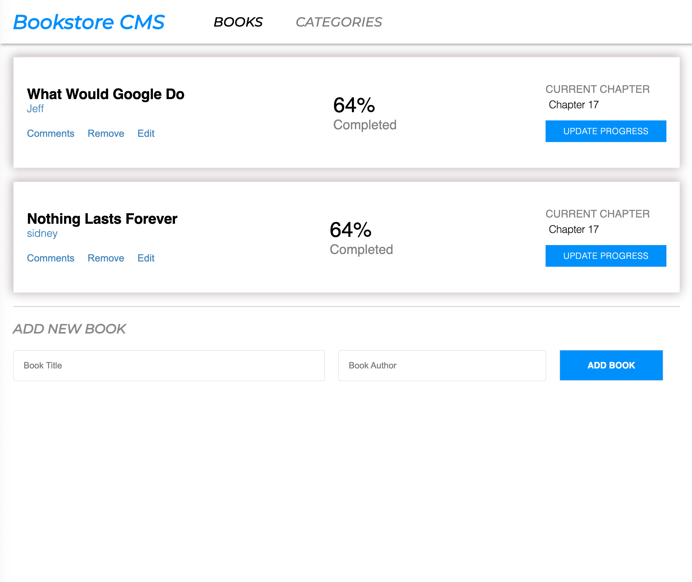

# Bookstore CMS
The Bookstore is a website that helps you;
- Display a list of books.
- Add a book.
- Remove a selected book.


## Built With
- HTML5
- CSS3
- React
- Linters

## Live Demo

For the link to the live demo, [Netlify](https://lynettes-bookstore.netlify.app/)

## installation

To get a local copy up and running follow these simple example steps.

- clone the repository by running
``` https://github.com/iLynette/bookstore.git ```
- navigate to the folder
``` cd <DIRECTORY> ```
- Install packages
``` npm i ```
- Run the app
``` npm start ```


The page will be opened in your browser

### Run linter tests

- To run linter tests run :
- npx stylelint "**/*.{css,scss}"
- npx eslint .

## Author
:bust_in_silhouette: **: Acholah Lynette**
- GitHub: [@iLynette](https://github.com/iLynette)
- Twitter: [@acholah_lynette](https://twitter.com/acholah_lynette)
- LinkedIn: [acholah lynette](https://www.linkedin.com/in/lynette-acholah/)

## 🤝 Contributing

Contributions, issues, and feature requests are welcome!

Feel free to check the [issues page](../../issues/).
## :memo: License
This project is [MIT](./MIT.md) licensed.